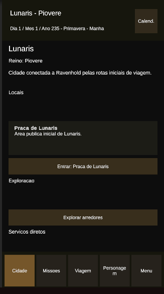
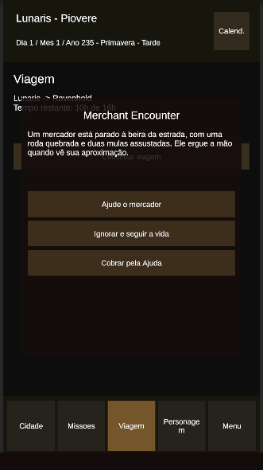
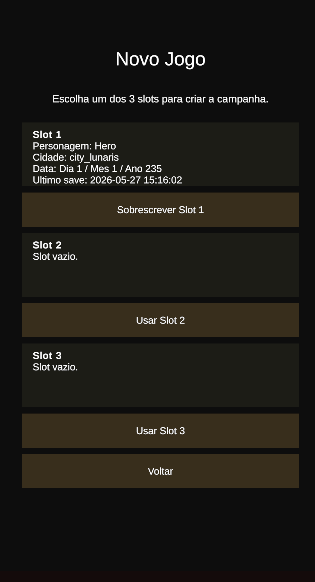

# Mundo de Fiore

**Mundo de Fiore** é um RPG de fantasia medieval em desenvolvimento, focado em exploração, narrativa, evolução de personagem, gerenciamento de grupo, guilda de aventureiros e sistemas clássicos de RPG adaptados para uma experiência mobile.

Meu foco destre projeto é o estudo de GameDesign, Criação/Estrutura de mundo e me aprofundar no funcionamento de IA, onde estou criando tudo ligado a documentação, funcionamento, mundo e narrativa, os codigos estão sendo gerados com e modificados com o Codex da OpenAI.

O projeto está sendo desenvolvido inicialmente como um protótipo jogável, com foco em construir uma base sólida de sistemas para futuramente expandir o mundo, as cidades, os NPCs, as missões e o combate.

---

## Visão Geral

O jogador assume o papel de um personagem customizável em um mundo de alta fantasia dividido entre diferentes reinos, culturas e raças. A aventura começa após o protagonista ser salvo por uma aventureira ligada à guilda dos **Gatos Negros**, uma guilda em decadência que poderá ser restaurada ao longo da jornada.

O jogo busca misturar:

- Exploração entre cidades e regiões
- Sistema de viagem com passagem de tempo
- Progressão de personagem
- Inventário e equipamentos
- Diálogos com escolhas
- NPCs com funções diferentes
- Missões com etapas
- Reputação e relacionamento
- Combate em desenvolvimento
- Construção e evolução de guilda

---

## Sistemas Implementados

### Sistema de Cidades

O jogo possui uma estrutura de cidades conectadas ao estado global do jogo. Cada cidade pode conter informações próprias, como nome, descrição, destinos disponíveis e possíveis interações.

Atualmente, o jogador consegue viajar entre cidades como **Lunaris** e **Ravenhold**, com a interface já funcionando para selecionar destinos.

---

### Sistema de Viagem

O sistema de viagem permite que o jogador escolha um destino e inicie uma rota entre cidades.

A viagem já possui funcionamento básico, incluindo:

- Seleção de destino
- Transição entre cidades
- Controle de origem e destino
- Retorno funcional entre cidades conectadas

Esse sistema será a base para futuras mecânicas de exploração, eventos aleatórios, encontros durante a viagem e passagem de tempo.

---

### Sistema de Interface Mobile

A interface do projeto está sendo criada com foco em telas verticais para celulares.

Já existe uma base funcional de UI, incluindo:

- Tela principal da cidade
- Aba de viagem
- Tela de inventário
- Tela de equipamentos
- Tela de status
- Interface de diálogo
- Botões de navegação entre sistemas

O objetivo é manter uma navegação simples, clara e confortável para dispositivos móveis.

---

### Sistema de Inventário

O inventário já permite armazenar e visualizar itens do jogador.

O sistema serve como base para:

- Itens consumíveis
- Equipamentos
- Itens de missão
- Recursos de criação
- Itens comprados ou recebidos em recompensas

Também já foi iniciado o funcionamento de itens consumíveis, permitindo que certos itens sejam usados diretamente pelo jogador.

---

### Sistema de Equipamentos

O projeto já possui uma base de equipamentos, permitindo que itens sejam equipados pelo personagem.

O sistema será expandido para incluir:

- Slot para mão direita
- Slot para mão esquerda
- Itens de duas mãos
- Remoção automática de itens equipados do inventário
- Restrições de uso por tipo de personagem
- Equipamentos iniciais baseados no estilo escolhido pelo jogador

---

### Sistema de Status

O personagem possui atributos que servem como base para testes, diálogos e futuramente combate.

A estrutura de status será expandida para incluir elementos como:

- Água
- Fogo
- Elétrico
- Terra
- Ar
- Luz
- Escuridão

Esses elementos serão usados no combate, em resistências, fraquezas, equipamentos, habilidades e possíveis interações narrativas.

---

### Sistema de Diálogo

O sistema de diálogo já permite conversas com NPCs usando uma HUD própria.

Funcionalidades implementadas ou planejadas na base do sistema:

- Nome do personagem falando
- Texto de diálogo
- Imagem/rosto do NPC
- Botão para avançar falas
- Botão para finalizar diálogo
- Múltiplas respostas
- Respostas desbloqueadas por atributos

Exemplo de uso futuro:

- Respostas comuns disponíveis para todos
- Respostas especiais liberadas por inteligência, carisma, força ou reputação
- Consequências diferentes dependendo da escolha do jogador

---

### Sistema de NPCs

O mundo de Fiore utiliza NPCs com diferentes categorias e funções dentro das cidades e regiões.

Algumas categorias previstas incluem:

- Lojista
- Taverneiro
- Aventureiro
- Ladrão
- Mercenário
- Profeta
- Pirata
- Nobre
- Rei
- Rainha
- Ferreiro
- Curandeiro
- Guarda
- Cidadão
- Mestre de Guilda

Essas categorias ajudarão a organizar interações, lojas, missões, diálogos e eventos no mundo.

---

### Sistema de Guilda

A guilda dos **Gatos Negros** será um dos pilares centrais do jogo.

Ela começa em decadência e poderá evoluir com o tempo, conforme o jogador:

- Completa missões
- Recruta novos membros
- Melhora a reputação da guilda
- Desbloqueia novas funções
- Expande a estrutura da guilda
- Envia membros para tarefas externas

O jogador poderá manter um grupo fixo de até 4 personagens, enquanto outros membros poderão atuar na guilda.

---

## Sistemas em Desenvolvimento

### Sistema de Missões

O sistema de missões será estruturado com etapas, permitindo criar objetivos mais interessantes do que apenas aceitar e entregar tarefas.

As missões poderão conter:

- Etapas sequenciais
- Requisitos específicos
- Recompensas
- Consequências
- Relação com NPCs
- Reputação com cidades, guildas ou facções
- Escolhas narrativas

---

### Sistema de Relacionamento e Reputação

NPCs e grupos poderão reagir ao jogador de acordo com suas escolhas e ações.

Esse sistema poderá afetar:

- Diálogos disponíveis
- Preços em lojas
- Missões desbloqueadas
- Recrutamento de personagens
- Reações de facções
- Eventos especiais

---

### Sistema de Criação de Personagem

O jogador poderá criar seu personagem escolhendo características importantes para a jornada.

Planejado para o sistema:

- Escolha de raça
- Escolha de aparência
- Definição de atributos iniciais
- Escolha de estilo inicial de personagem
- Equipamento inicial baseado no estilo escolhido

Exemplos:

- Guerreiro começa com espada
- Mago começa com varinha
- Ladino começa com adaga
- Arqueiro começa com arco

---

### Sistema de Combate

O combate será uma das próximas grandes etapas do projeto.

A ideia é criar um sistema baseado em atributos, equipamentos, elementos e composição de grupo.

Elementos planejados:

- Ataques físicos
- Ataques mágicos
- Fraquezas elementais
- Resistências
- Equipamentos influenciando combate
- Habilidades por personagem
- Possível combate em turnos

---

### Sistema de Calendário

O mundo terá um calendário próprio.

O ano começa em **235** e possui **8 meses**, com uma nova estação a cada 2 meses.

Esse sistema poderá ser usado para:

- Eventos sazonais
- Festivais
- Missões temporárias
- Passagem de tempo em viagens
- Rotina de NPCs
- Mudanças no mundo

---

### Sistema de Acampamento e Conhecimento

Durante viagens, o jogador poderá descansar em acampamentos ou alojamentos.

Esse sistema poderá permitir:

- Conversas entre personagens
- Recuperação de recursos
- Aprendizado sobre o mundo
- Eventos narrativos
- Desenvolvimento de relacionamento com o grupo

---

## Mundo e Lore

O mundo de Fiore é dividido em cinco grandes reinos:

- **Sole**
- **Roccia**
- **Cielo**
- **Piovere**
- **Anima**

Cada reino possui cultura, geografia, política, arquitetura e povos próprios.

O mundo também conta com diversas raças criadas por divindades, como humanos, anões, orcs, tritões e outras espécies que fazem parte da história e da estrutura social de Fiore.

---

## Objetivo do Projeto

O objetivo inicial é criar um protótipo funcional com os principais sistemas de RPG conectados entre si.

A prioridade atual é construir uma base sólida para que o projeto possa crescer de forma organizada, permitindo adicionar novos conteúdos, cidades, NPCs, missões, itens e mecânicas sem precisar refazer sistemas principais.

---

## Próximos Passos

Algumas das próximas etapas planejadas são:

- Melhorar o sistema de viagem
- Ajustar a organização da interface
- Expandir status e elementos
- Melhorar o sistema de equipamentos
- Criar seleção de raça e estilo inicial
- Implementar missões com etapas
- Criar reputação com NPCs e facções
- Iniciar o sistema de combate
- Expandir a guilda dos Gatos Negros
- Adicionar eventos durante viagens
- Melhorar a integração entre cidade, NPCs e inventário

---

## Status do Projeto

O projeto está em fase de protótipo, com vários sistemas principais já funcionando de forma inicial.

A base atual já permite testar navegação, cidades, viagem, inventário, equipamentos, diálogos e estrutura de UI. Os próximos ciclos de desenvolvimento serão focados em robustez, progressão e combate.

---

## Tecnologias

- Unity
- C#
- ScriptableObjects
- Interface mobile vertical
- Estrutura modular de sistemas

---

## Observação

Este projeto está em desenvolvimento ativo e sua estrutura poderá mudar conforme novos sistemas forem adicionados e refinados.
